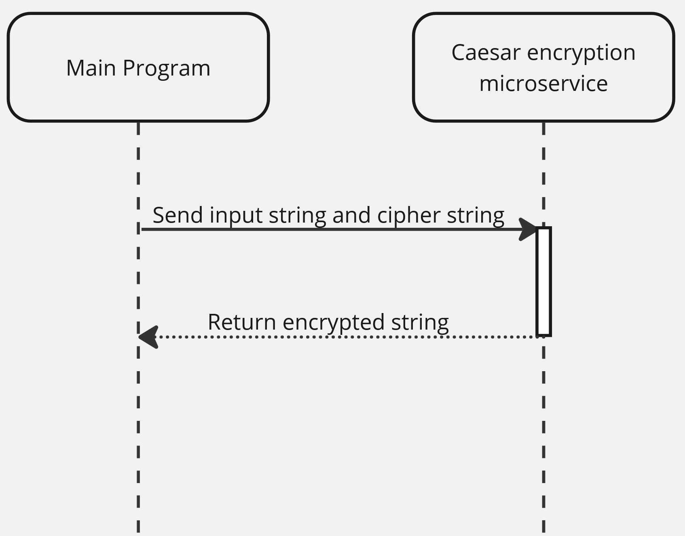

# Caesar-Microservice
Python microservice with a modified caesar encryption using ZeroMQ.

The caesar.py file will take in a JSON message containing an input string (to encrypt) as well as a cipher string. It will then perform a caesar-style encryption by shifting letters in the input string to the right, but iterates over the cipher string to do so. For example, sending "HELLO" with the cipher "abc" will shift H by 1 (a), E by 2 (b), the first L by 3 (c), the second L by 1 (back to a), and the O by 2 (b). Input string letter case is maintained and non-letters are returned as they were.

The test_main.py file is a test main program. Its purpose is simply to send data to the caesar microservice and then receive it back.

To send data, run caesar.py first. It will say that it is waiting to receive data. Next, run test_main.py alongside it. Type in the input string and cipher string. These will be joined together in a JSON message in the send_request() function, which will send the message over port 4949 (by default).

Receiving data is automatic. Once the caesar encryption is complete the output encrypted string will be sent back over ZeroMQ where the main program is waiting to receive it with the receive_response() function.

Below is a UML diagram for this microservice.

